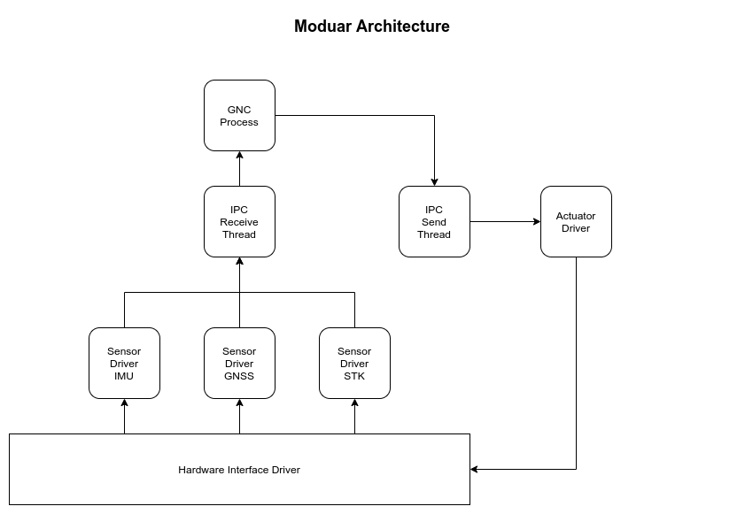
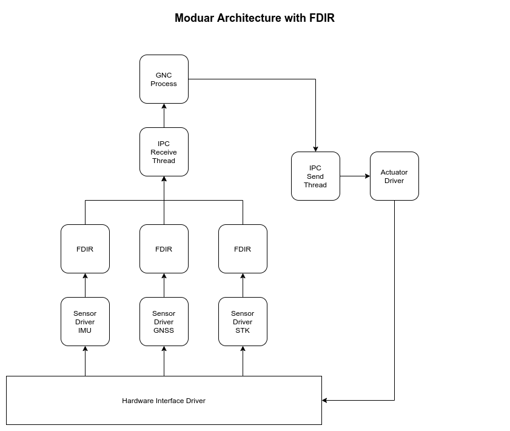
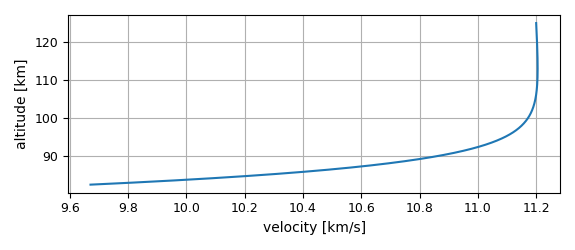
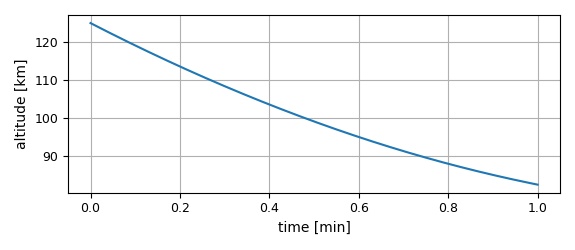
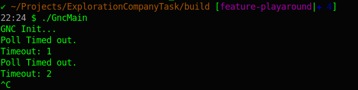
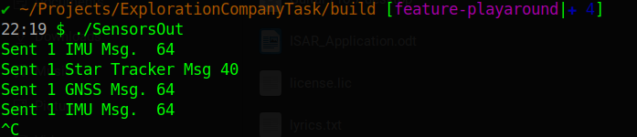
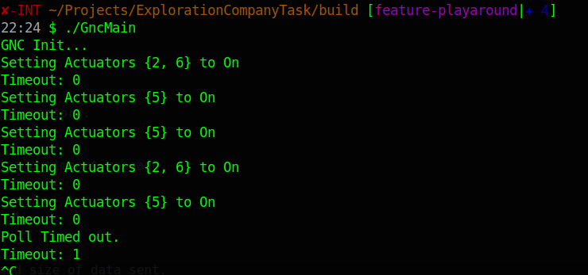
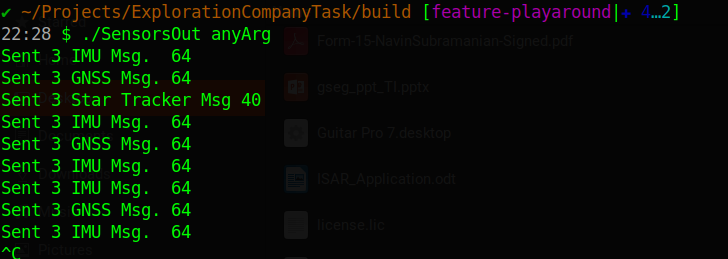

The Exploration Company Data Processing Task.

# Task Overview:
1.  Three Input Sensors
    - IMU
    - GNSS
    - Star Tracker

2. Outputs
    - 6x Thrusters

3. GNC Stub Function
    - Takes the input and outputs on/off State for the thrusters.
    - Input data can be null.
    - Multiple rates implied for sensors here.

Goals:
1. Scable, Reusable Software Framework
    - Adding Functionality with less interface level changes.
    - Reuse with diffrent hardwares.
2. Capabilities to handle more sensors
3. Perform FDIR algorithms on sensors.

# Assumptions:

1. Sensors
    - Generally the IMU has the higher sampling rates. 
    - Assume the IMU sampling is done at 100 Hz. 0.01s
    - All the sensors are interfaced to unique hardware serial interfaces.
    - The GNSS generally has a 1Hz sampling rate, although higher rates are often possible.
        - Assume the GNSS sampling is 10Hz. 0.1s.
    - Star Trackers have low sampling frequencies.
        - Assume the Star tracker rate is 1Hz. 1s.

    - The time-synchronization logic between these sensors is *not considered*.
        - This is required by navigation. However it is very device specific.

2. FDIR
    - The Fdir Application is setup to receive data from 3x IMU, GNSS and Star Tracker.
    - It currently statically selects a sensor and outputs it to the GNC application.
        -

# Summary or requirements.

|    |                  Requirement                 |                           Realization by Design                           |
|:--:|:--------------------------------------------:|:-------------------------------------------------------------------------:|
| 1. |           Reduce code duplication.           |             Commonly required functions turned into libraries.            |
|    |                                              |         Library functions utilized by application layer software.         |
| 2. |        Reusable by different Hardware        |                       Using Standard libraries only.                      |
|    |                                              |                        Relying on OS defined API's                        |
|    |                                              |        No usage of compiler specific / Target specific functions.         |
| 3. | GNC Execution on receiving any sensor data.  | Event driven programing to handle multiple sensor rates.                  |
|    |                                              | Using Poll on IPC sockets to handle multiple messages on a single thread. |
|    |                                              |                                                                           |

# Design Choices

Architecture

1. The solution was to break down the GNC and Sensor tasks into seprate processes.
    - This limits the interaction between processes to the Interfaces of GNC.
    - This can abstract the serial / sensor interface from the GNC application.
    - The cost of this is the need for inter process communication.
    - 
    - 

2. IPC
    - Simple UDP unicast was used for IPC.
    - Queues were not implemented as Linux does maintain double buffered queues in the kernel for sockets.
    - Due to time-constraints full fledged error handling is not implemented.
        - Real world implementation would have to consider a lot of error cases.

3. Threading
    - Pthreads has been used for thread implementation.
    - This is mainly used to simulate multiple-rate sensor data on the IPC network.

4. GNC
    - GNC Software does not run at a fixed rate.
    - It is designed to run asynchronously based on input messages on the IPC.
    - Poll is used to monitor the list of IPC sensor inputs for data waiting to be read.
        - In case any of the sensor inputs are available, it is processed and an unique output is set.

5. Bonus Features and general comments.
    - csv files were initially generated for the sensor data.
        - To avoid writing a parser for csv in c, a pivot to the npy format for data storage was used.
        - A small lightweight library has been included as a submodule to read the npy binary files.
        - The Re-entry trajectory for which the data has been generated is also provided.

    - Re-Entry Trajectory
        - 
        - 

    - Code is compiled with all warnings enabled.
        - Apart from the submodule, there are no warnings.
    - Use of Global variables or variables at file scope.
        - This has been done to save time during development.
        - Ideally, scope of the variables must be reduced.
    - The type safety offered by c++ is really usefull.

# Build and Running Instructions

1. Repository set up
    - ` git clone https://github.com/navin56/ExplorationCompanyTask.git `
    - ` git submodule init `
    - ` git submodule update `

2. Build Process Manual
    - ` mkdir build & pushd build `
    - ` cmake .. `
    - ` make `

3. Running The Simple example without TMR and Multiple sensors.
    - Start the Gnc Application first.
        - ` ./GncMain `
        - Since no sensors are active, it should print a timeout message.
        - 

    - Start the Sensor application in another terminal.
        - ` ./SensorOut `
        - 
        - It prints out messages regarding sensors and size of data sent.
    - If the magic smoke has not escaped, the Gnc application should print 
        messages about setting some actuators.
    - 

4. Running with FDIR.
    - Start the Gnc Application.
        - ` ./GncMain `
    - Start the Sensor application in another terminal with any argument.
        - ` ./SensorOut anyArg `
        - 
    - Start the Sensor FDIR Application.
        - ` ./FdirHandler `
